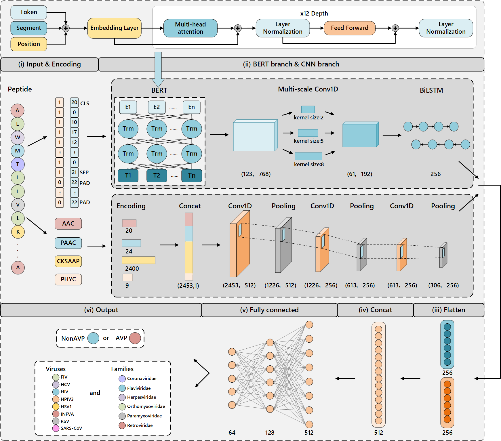

# BERTAVP: an interpretable multi-task learning model for identification and functional prediction of antiviral peptides
Antiviral peptides (AVPs) have potential to enhance our response to viral diseases, making them a valuable addition to therapeutic options. Most studies do not analyze the focus of their models or lack predictions for subclasses. Therefore, it is necessary to have a functional prediction of AVPs with an interpretable model. However, developing predictive and interpretable models remains a challenge because of restricted peptides representation and data imbalance. Here, we introduce BERTAVP, an interpretable deep learning framework, for identifying AVPs and characterizing their functional activities (eight species and six families). First, it utilizes the BERT branch to extract peptide features and CNN branch to extract amino acid and physicochemical features. It then applies the focal loss to mitigate the negative impact caused by imbalanced datasets. Finally, we further analyze biological patterns and key motifs learned by BERTAVP, finding ELDKWA and SLWNWF motifs demonstrate the strongest antiviral properties within the AVPs. Experimental results on public datasets show our model achieves superior performance in identification and functional prediction of AVPs.

Notly! Feature extraction and model training are performed in different environments. Feature extraction uses `feature_extract.yml`, while model training uses `environment.yml`. The most critical modules of  `environment.yml` are: `tensorflow(2.6.2),transformers(4.11.3),keras(2.6.0)`. The most critical modules of  `feature_extract.yml` are: `Bio(1.75),modlamp(4.1.2)`

First, you need to download the official BERT model weights from the following address:

`https://huggingface.co/google-bert/bert-base-uncased/tree/main`

And file to the folder `bert-base-uncased`

Second, four feature descriptors(AAC+CKSAAP+PAAC+PHYC) features are generated using `feature_extract.py`

Finally, Using the file `classification(AVP_NonAVP).py` and `classification(subclasses).py` for identification and functional prediction of antiviral peptides 
